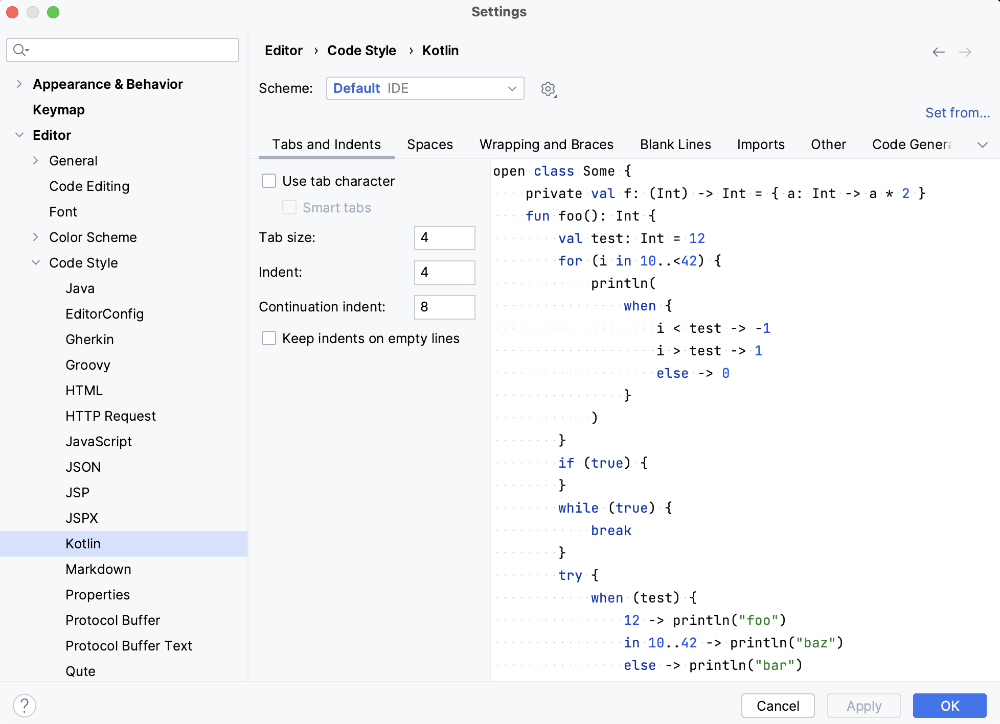

IntelliJ IDEA provides two ways to comply with the project’s code style guidelines:
**_code schemas_** and **_editor configs_**.
In this lesson, we will talk about both of them.

### Code schemas

There are two predefined code schemas:

- **Project scheme**: you configure settings for one specific project, they’re stored in the codeStyles folder
  under **.idea** and are shared through the VCS together with the project.
- **Default scheme**: you configure the settings that could be applied to all the projects you work on in the IDE that have the Default
  schema selected.

Note that code schemas are language-specific.

To configure the **code schema**,
1. Press `⌘,` (macOS) or `Ctrl+Alt+S` (Linux/Windows) to open the IDE settings and select Editor | Code Style.
2. Select `Kotlin` programming language.
3. Select the code schema you would like to configure (Project or Default).
4. Configure code style settings, such as tabs and indents, import settings (using single name import or import with `*`), and many others.

    

### EditorConfig

Another way to configure code style settings is to define the **EditorConfig.**
Adding an EditorConfig to your project is pretty easy – you just need to add the `.editorconfig` file to the directory you
would like to apply code style settings to.

It is also possible to have several `.editorconfig` files in the project,
for example, one for the source code and another for tests. Just put them in the corresponding folders, and all settings
will be applied to all sub-folders.

There are two types of settings in `.editorconfig` files:
- Standard options from EditorConfig, such as `tabs_width` or `indent_size`. The full list of options
is available [here](https://github.com/editorconfig/editorconfig/wiki/EditorConfig-Properties).
- IntelliJ IDEA-specific options, their names start with the `ij_` prefix. For example, `ij_smart_tabs`.

To better understand how EditorConfig works and see examples, please read its
specification [here](https://spec.editorconfig.org/).
If some property is not configured in `.editorconfig`, the IDE takes it from the code schema.

**See Also**: [Detailed overview of formatting features by Trisha Gee](https://blog.jetbrains.com/idea/2020/06/code-formatting/)
