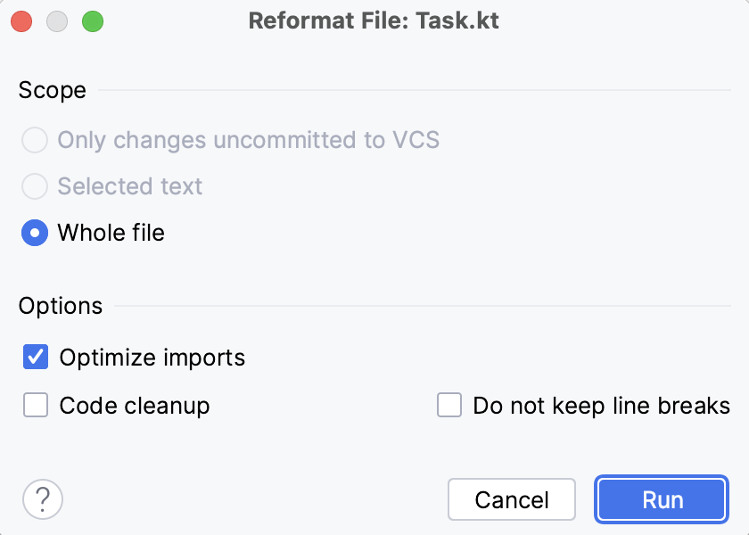

# Task 4/4: Reformat the code using IDE

### Theory

To perform any refactoring in the IDE, you can use the Refactoring Menu or a specific shortcut. 
It’s also possible to configure custom shortcuts.
Use the **&shortcut:ReformatCode;** (macOS) or **Ctrl + Alt + L** (Windows/Linux) shortcut to make the IDE automatically reformat your code.
You can run it on some specific code fragment if you first select it and then type the shortcut, but you can also run it on the whole file.

You can specify reformatting settings in the **Reformat dialog**, which is available by pressing
**&shortcut:ShowReformatFileDialog;** (macOS) or `Ctrl+Alt+Shift+L` (Windows/Linux) shortcut.
In this dialog, you can specify the scope of formatting changes and select the options to apply:
- **Optimize imports** option will remove all unused imports in your file. Alternatively, you can invoke it using the **&shortcut:OptimizeImports;** or **Ctrl+Alt+O** (Windows/Linux) shortcut.
- **Code cleanup** option runs code cleanup inspections.
- **Do not keep line breaks** option reformats line breaks according to the code style settings.

    

### Task

In this task, you need to reformat the provided code fragment using the shortcut. 

### Hints

  Use &shortcut:ReformatCode; (macOS) or Ctrl + Alt + L (Windows/Linux) to reformat code.

