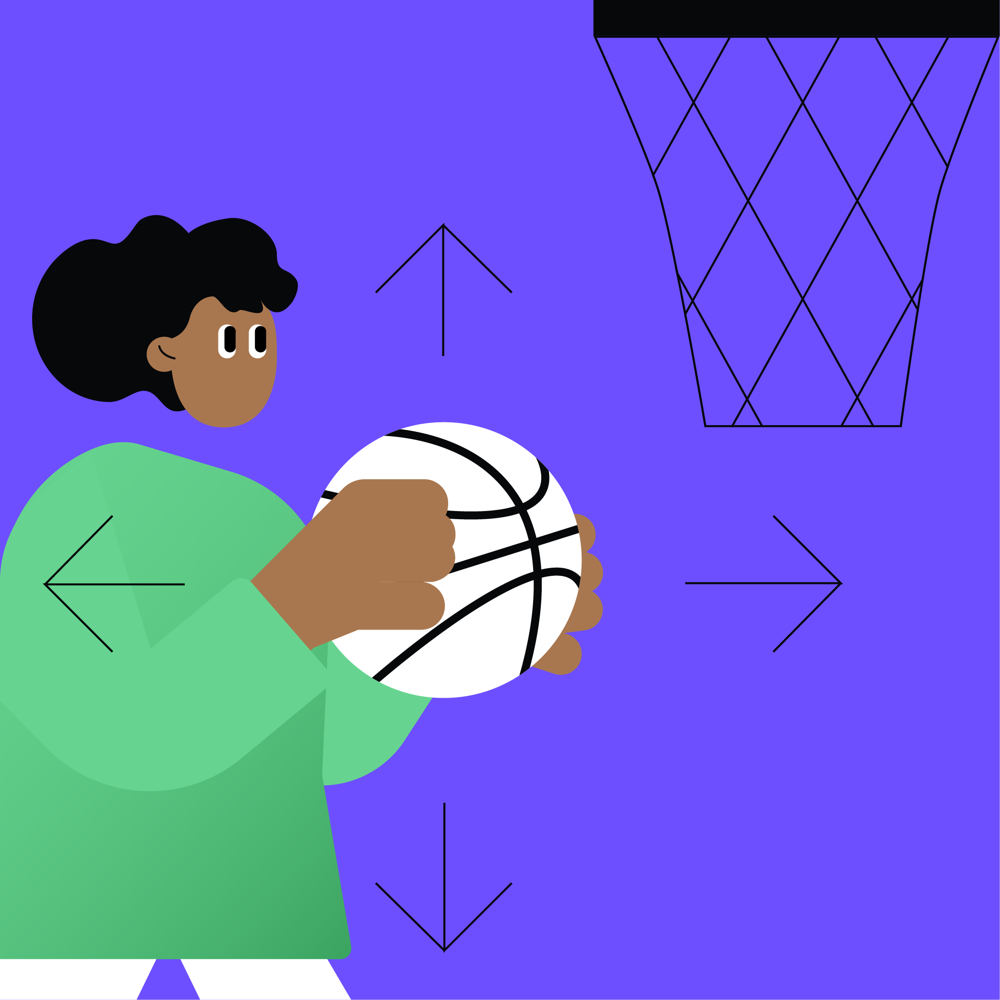

# Section 4: Moving code

In this section, we will cover the following topics:

- Cohesion and coupling
- Move refactoring
- Feature Envy code smell
- Pull Up refactoring
- Push Down refactoring

    

