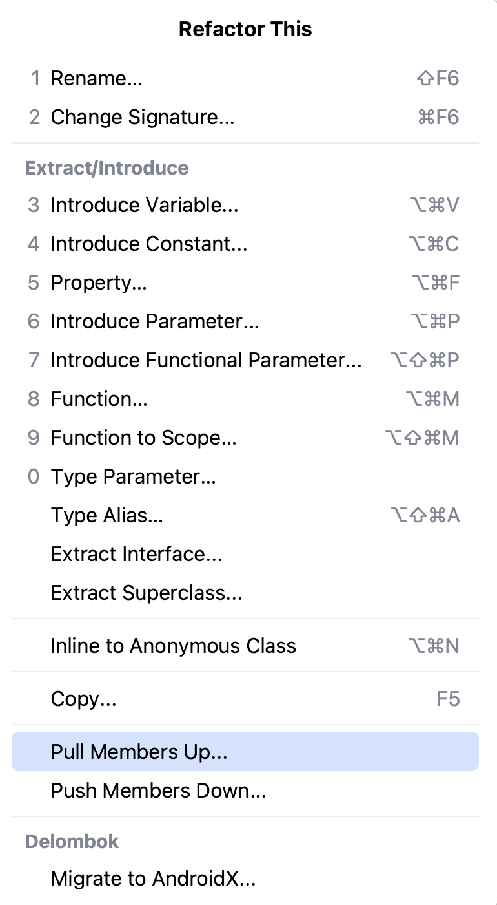

To avoid code duplication and ensure consistency, we use the _**Pull Up refactoring**_. If multiple sibling classes in a
class hierarchy define the same properties or methods with the same signature and identical method bodies, we move them
to a common base class. This way, we eliminate redundant code. Thus, when we fix an issue in one place, it is solved for
all the places where it is reused, which prevents inconsistencies.

We apply the _**Push Down refactoring**_ when a property/method in a superclass is used only by one of its subclasses. By
moving the property/method to the specific subclass, we simplify the class hierarchy and improve code organization. This
refactoring is the inverse of the Pull Up refactoring.

To invoke the Pull Up or Push Down refactoring, click on the element you would like to move, press
**&shortcut:Refactorings.QuickListPopupAction;** (macOS) or **Shift+Ctrl+Alt+T** (Windows/Linux), and select the _Pull
Members Up_ or _Push Members Down_ option.

    

