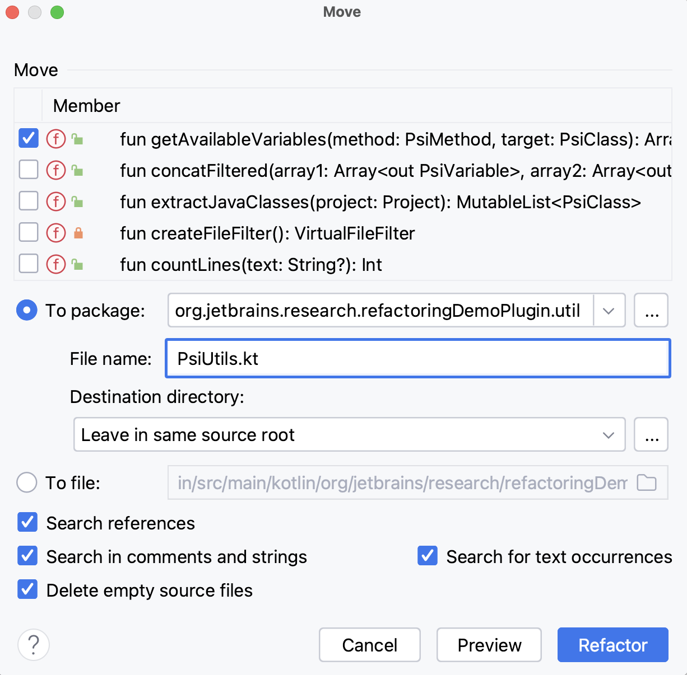

The next refactoring that we will discuss in this course is **_Move refactoring_**, which is a process of moving a code
entity (e.g., a method or a class) from one place to a more appropriate place, making the codebase more organized and
easier to understand. We apply Move refactoring when we want to improve the structure of the code and enhance its
readability, maintainability, and extensibility.

Sometimes a function or property is used more often in another class than in its own class. Other times, a class
collaborates mostly with other classes from another package. These are all examples of the **_Feature Envy_** code smell. To
resolve this, we move the code entity closer to the entities it interacts with.

To perform Move refactoring, click on the code element you want to move and press the **F6** shortcut. When the refactoring
dialog appears, specify the target class/package and click Refactor. It is also possible to see the refactoring preview.

    

Currently, in Kotlin, the move refactoring **is restricted to top-level declarations and nested classes** only.
For other scenarios, you'll need to perform the move refactoring manually.