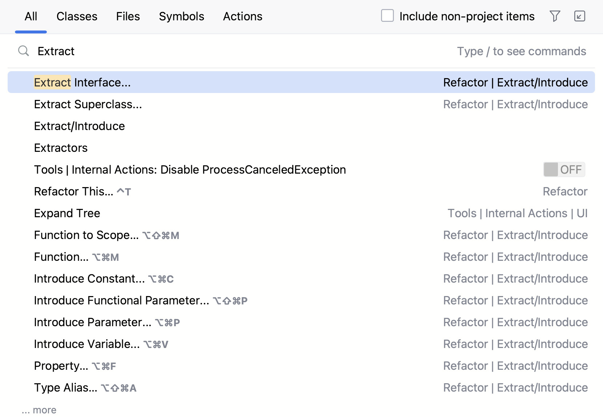

# Task 1/1: Getting familiar with IDE refactoring features

There are two places to explore available refactoring actions in the IDE: the **Refactor This** and **Search Everywhere**
dialogs.

### Refactor This
To invoke refactoring in IntelliJ IDEA, select an item to refactor (a variable, method, class, package, etc.)
and press **&shortcut:Refactorings.QuickListPopupAction;** (macOS) or **Shift+Ctrl+Alt+T** (Windows/Linux) to open a
list of
refactorings that can be applied.
You can also use a shortcut to invoke specific refactoring.

It is possible to undo any refactoring by pressing **&shortcut:$Undo;** (macOS) or **Ctrl + Z** (Windows/Linux).

    

### Search Everywhere
If you want to refactor some code and are unfamiliar with the IDE’s refactorings shortcuts, you can open the **Search
Everywhere** dialog and type the name of the action you would like to perform.

To open the **Search Everywhere** dialog, press **⇧⇧** (macOS) or **Shift+Shift** (Windows/Linux).

For example, if you want to extract a function or explore any extract possibilities in the IDE,
open the **Search Everywhere** dialog, type “Extract”, and it will show the available options.

    

Moreover, for some refactorings, IntelliJ IDEA allows users to see the preview before applying changes.
It could be useful if you are not sure how refactoring changes would affect your code and want to make sure that it
would work as you expect.

### Refactoring shortcuts
Here is a table with the most popular refactorings and shortcuts to invoke them:

| Refactoring type       | Description                                                            | Shortcut                                                            |
|------------------------|------------------------------------------------------------------------|---------------------------------------------------------------------|
| **Refactor This**      | Shows available refactoring options.                                   | ⌃T (macOS) or Shift+Ctrl+Alt+T (Windows/Linux)                      |
| **Rename**             | Changes the name of the code element.                                  | &shortcut:RenameElement; (macOS) or Shift+F6 (Windows/Linux)        |
| **Change Signature**   | Allows to change the method’s name, parameters, and return type.       | &shortcut:ChangeSignature; (macOS) or Ctrl+F6 (Windows/Linux)       |
| **Introduce Variable** | Extracts a value into a new variable.                                  | &shortcut:IntroduceVariable; (macOS) or Ctrl+Alt+V  (Windows/Linux) |
| **Inline**             | Removes a variable/method and puts its body to the place it’s used at. | &shortcut:Inline; (macOS) or Ctrl+Alt+N (Windows/Linux)             |
| **Extract Function**   | Creates a new method and moves a selected piece of code to it.         | &shortcut:ExtractMethod; (macOS) or Ctrl+Alt+M (Windows/Linux)      |
| **Move**               | Moves code method/class to another place in the codebase.              | &shortcut:DatabaseView.MoveToGroup; (macOS) or F6 (Windows/Linux)   |

We will discuss these and other refactorings in the following lessons.

**See Also**: [IntelliJ IDEA keyboard shortcuts sheet](https://resources.jetbrains.com/storage/products/intellij-idea/docs/IntelliJIDEA_ReferenceCard.pdf)
